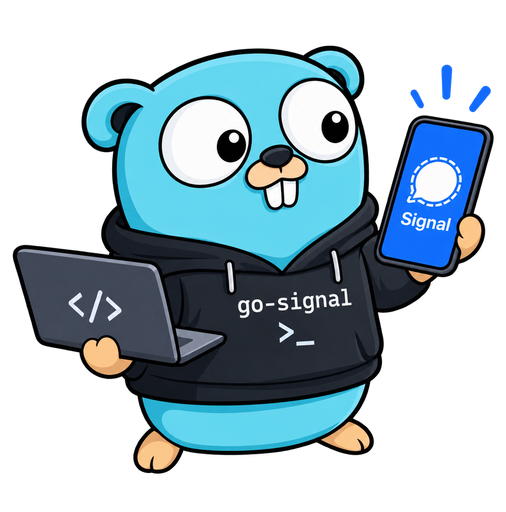

# go-signal

<p align="center">
  
</p>

A command-line client for the [Signal](https://signal.org) messenger, written in Go. It is a Java-free
alternative to [signal-cli](https://github.com/AsamK/signal-cli) with its own idiomatic CLI. It
runs as a linked device next to your phone: it sends and receives messages, reactions, receipts
and attachments, lists contacts, groups and identities, and can serve your account to AI agents
over [MCP](docs/mcp.md).

> **Status:** usable, but young. Linux, macOS and Windows on amd64 and arm64 are supported. See
> [PLAN.md](PLAN.md) for the roadmap.

## Install

### Release binaries

The [releases](https://github.com/cwbudde/go-signal/releases) have a single, self-contained
binary for Linux, macOS and Windows on amd64 and arm64. On Linux and macOS:

```sh
curl -fsSL https://github.com/cwbudde/go-signal/releases/latest/download/install.sh | sh
```

The [script](scripts/install.sh) downloads the latest release for your OS and CPU, checks it
against the release's `SHA256SUMS` and installs `go-signal` to `~/.local/bin`. Set
`GOSIGNAL_VERSION=0.2.0` for a specific release, or `GOSIGNAL_INSTALL_DIR` for another
directory (`… | sudo GOSIGNAL_INSTALL_DIR=/usr/local/bin sh`).

On Windows, download `go-signal_<version>_windows_amd64.zip` (or `_arm64`) from the release and
put `go-signal.exe` on your `PATH`.

The archives also contain man pages, shell completions and, for Linux, a systemd timer (see
[Staying linked](#staying-linked)). To check a manual download, compare it with the release's
`SHA256SUMS`, or verify its [build provenance](https://docs.github.com/en/actions/security-for-github-actions/using-artifact-attestations)
with `gh attestation verify <archive> --repo cwbudde/go-signal`.

### With Go

With Go 1.26 or later:

```sh
go install -tags libsignal_go github.com/cwbudde/go-signal@latest
```

This installs to `$(go env GOPATH)/bin`. Don't leave out `-tags libsignal_go`: it selects the
pure-Go backend the releases use. Without it, Go builds the cgo backend, which needs a libsignal
library built with Rust (see [Development](#development)).

### Container

`ghcr.io/cwbudde/go-signal` (linux/amd64, linux/arm64) holds only the binary. Keep the account data
in a volume mounted at `/data`:

```sh
docker run --rm -it -v go-signal:/data ghcr.io/cwbudde/go-signal link
docker run --rm -v go-signal:/data ghcr.io/cwbudde/go-signal receive
```

## Quick start

```sh
# 1. Link go-signal to your account: scan the QR code in the Signal app on your phone
#    (Settings > Linked devices > Link new device). Contacts and groups sync afterwards.
go-signal link --name laptop
go-signal account show

# 2. Send a message: to a number, @username, group or yourself.
go-signal send +4915112345678 -m "Hello from go-signal"
go-signal send self -m "Note to self" --attach notes.pdf

# Send a sticker using a pack's share link and the sticker's numeric ID (0 is valid).
go-signal send self --sticker-pack 'https://signal.art/addstickers/#pack_id=...&pack_key=...' --sticker-id 0

# Edit your own message, using the timestamp printed by its original send.
go-signal send +4915112345678 --edit 1790000000000 -m "Corrected text"

# 3. Receive what is waiting on the server, or keep streaming with --follow.
go-signal receive
go-signal receive --follow -o json   # one JSON document per event (docs/json.md)
go-signal receive --download-attachments ./downloads   # includes embedded sticker images
```

`go-signal <command> --help` and the man pages (`man go-signal-send`) describe every command.
[docs/json.md](docs/json.md) documents the JSON output.

Sticker sends contain only the sticker: text, stdin, attachments, replies and edits cannot be
combined with `--sticker-pack` and `--sticker-id`. The pack link supplies its ID and key; only
the selected image is fetched and uploaded, once for all recipients. Use a sticker ID from
that pack's author or another source that lists its IDs. Pack installation/listing is deferred.
WebP, PNG/APNG and GIF bytes are preserved, including animation. Received sticker images are
downloaded only with `--download-attachments`; failures appear per image and receiving continues.
Downloads use the image embedded in the message, without fallback if it has expired on the CDN.

`send --edit <timestamp>` works for users, groups (`--group <id>`) and `self`, including messages
sent from your other devices when you know their timestamp. Supply the replacement content;
go-signal does not reload the original text, mentions, quote or attachments. The live integration
test covers text edits. Signal normally permits 10 edits within 24 hours; Note to Self has no
time limit. Recipients enforce eligibility, and a successful send only confirms transport.
See [Signal's editing rules](https://support.signal.org/hc/en-us/articles/6255134251546-Edit-Message).

Pin/unpin messages in users, groups or Note to Self with `pins add` and `pins remove`.
Supply `--target <author>:<timestamp>` and, for adding, explicit `--duration <seconds>` or
`--forever`. `pins list --chat <ACI|group:ID>` inspects retained inbox observations offline,
with completeness always unknown. See [pinned messages](docs/pins.md) for permissions and history limits.

Create a group with yourself as administrator and one or more members:

```sh
go-signal groups create "Weekend" --member +4915112345678 --member @alice.42
go-signal groups create "Private notes"   # a group containing only you
```

Members can be numbers, ACIs or usernames. Duplicates are ignored; users without available
profile credentials receive invitations. The output lists the group ID, members and pending
invitations. Members may edit group information and add members; invite links start disabled.
Each invocation creates a new group. If creation fails with a group ID, inspect it with
`groups show <id>` before retrying: the server may have created the group already. Success
confirms creation; individual notification failures may only be logged by signalmeow.

To rename a group, list it first, then use its title or ID:

```sh
go-signal groups list
go-signal groups rename "Family" "Family and friends"
```

You must be a full member with permission to edit group information. The command prints the
updated group and remembers the new title for subsequent commands. An unchanged title sends
no update; a concurrent change fails with a retry hint. A successful rename confirms the server
update; failures notifying members are logged separately.

Update a group's description, avatar, disappearing-message timer or permissions:

```sh
go-signal groups update "Family" --description "Family plans" --timer 86400
go-signal groups update "Family" --announcements-only --edit-permission admins --add-member-permission admins
go-signal groups update "Family" --description= --timer 0 --announcements-only=false
go-signal groups update "Family" --avatar family.png --description "Family plans"
go-signal groups update "Family" --remove-avatar
```

Supply at least one setting. Omitted flags preserve existing values; an empty description
clears it, and `--timer` accepts integer seconds (`0` disables the timer). Permission values
are `members` or `admins`. Description, avatar and timer changes require full membership and permission
to edit group information; changing permissions or announcement mode requires an administrator.
Every supplied setting is checked against current permissions before any change is submitted.
Without `--avatar`, an unchanged update sends nothing and leaves the revision unchanged. All changed settings go
in one patch, without automatic conflict retries. Success prints fresh server state, including
who can edit details and add members. If the server accepted the change but fetching its result
failed, inspect `groups show <id>` before retrying. Member notification failures are logged.
If the reply cannot establish acceptance, the error identifies an uncertain outcome, the group
ID and attempted revision; inspect the group before retrying rather than assuming failure.
Use `groups rename` to change the title.

`--avatar` accepts a regular PNG or JPEG file up to 2 MiB and 2048 pixels in each dimension.
These are local input limits; images are validated and uploaded unchanged, without resizing.
`--remove-avatar` clears the avatar; the two flags are mutually exclusive. Omitting both
preserves it. Setting an avatar always uploads and changes the revision, even when you supply
the same file again; removing an already absent avatar leaves the revision unchanged.
The output includes the current opaque `avatarPath`, without downloading the image.

All supplied settings are authorized before uploading. An upload failure leaves group state
unchanged; a later conflict or failed patch can leave unused encrypted image data on the CDN.
Avatar and other settings are applied in one group patch. Phone rendering and restoration
require the separate [live check](docs/dev.md#group-avatar-live-check).

To add members or invite users to an existing group:

```sh
go-signal groups add-members "Family" +4915112345678 @alice.42
```

You must be a full member with permission to add members. Recipients without available
profile credentials receive invitations; the output shows the server's actual members and
pending invitations. Existing members, pending invitations, yourself and duplicates are
skipped. Administrators can approve join requests with the same command. Banned ACIs are
rejected. All recipients are resolved before a single change is submitted; conflicts fail
without automatic retries. If a change succeeds but fetching the result fails, the error
reports that it was accepted: inspect `groups show` before retrying. Notification failures
after a confirmed change are logged separately.

Administrators can remove members, revoke invitations or reject join requests:

```sh
go-signal groups remove-members "Family" +4915112345678 @alice.42
```

Recipients can be numbers, ACIs or usernames; duplicates are ignored. Every recipient must
currently be a member, invited or requesting to join. All recipients are checked before the
change is submitted, and a concurrent group change fails with a retry hint. The output shows
the updated group. Removal does not ban someone from rejoining; use `groups leave` to leave
yourself. Success confirms the server update; member notification failures are logged.
Invitations known only by phone-number identity (PNI), which the current backend cannot
decrypt, cannot be removed with this command.

Administrators can ban users from a group or lift existing bans:

```sh
go-signal groups ban "Family" +4915112345678 @alice.42
go-signal groups unban "Family" @alice.42
go-signal groups show "Family"   # includes the banned users and ban times
```

Banning removes full membership, revokes an invitation or rejects a join request in the same
change, and prevents joining or requesting through a group link. You can also ban an absent
user. Unbanning permits rejoining but does not add the user back. Recipients can be numbers,
ACIs or usernames; all targets resolve to ACIs before one patch. You cannot target yourself.
Existing PNI bans are shown and preserved, but these commands cannot change them or remove
PNI-only invitations. Duplicates and unchanged bans are skipped; a complete no-op preserves
the revision and still requires current administrator access. Existing ban times are preserved.

Success prints fresh server state. Conflicts are not retried; inspect `groups show <id>` before
retrying accepted or uncertain failures. Notification failures after acceptance are logged.
Preventive bans do not notify absent users, and unbanning does not notify the unbanned user.
Phone behavior and blocked link joining require the separate [live check](docs/dev.md#group-ban-live-check).

Administrators can promote or demote full members:

```sh
go-signal groups promote "Family" +4915112345678 @alice.42
go-signal groups demote "Family" @alice.42
go-signal groups demote "Family" self   # another administrator must remain
```

Numbers, ACIs, usernames and `self` are accepted; duplicates count once. Every target must
be a full member, and all targets are checked against fresh server state before one combined
change. Invitations and join requests cannot have their roles changed. At least one full
administrator must remain, including in a group containing only you. Existing requested
roles are skipped; an entirely unchanged request preserves the revision. The output shows
the freshly fetched group. Conflicts are not retried. If a failure reports an accepted or
uncertain change, inspect `groups show` before retrying; notification failures are logged.

Inspect or manage a group's invite link:

```sh
go-signal groups link show "Family"
go-signal groups link update "Family" --state enabled-with-approval
go-signal groups link update "Family" --reset
go-signal groups link update "Family" --state disabled
```

States are `disabled`, `enabled` (anyone with the link can join) and
`enabled-with-approval` (an administrator must approve requests). Showing a link requires
full membership; changing it requires an administrator, even for an unchanged request.
Supply `--state`, `--reset`, or both. Omitted state is preserved. Disabling preserves the
password, so re-enabling restores the same link. Resetting invalidates the old URL and does
not enable a disabled link. First enabling a link creates its password in the same change.

Success prints fresh link state and, only when enabled, the URL. Invite URLs contain the
group master key and password; they appear only in these explicit link commands, never in
ordinary group output. An unchanged state without reset leaves the revision unchanged.
Changes are submitted once without retries. Inspect `groups link show <id>` before retrying
accepted or uncertain failures; member notification failures are logged separately. See
[the live check](docs/dev.md#group-link-live-check).

Join a group through an invite link for the selected account:

```sh
go-signal groups join 'https://signal.group/#…'
go-signal --account +4915112345678 groups join 'sgnl://signal.group/#…' -o json
```

An open link joins as an ordinary member. A link requiring administrator approval
submits a request and reports `requesting`; it does not claim full membership.
Freshly established membership or an existing request is a successful no-op.
If fresh state identifies an existing invitation, use `groups accept <group>`
with a known group reference or accept it on the phone.
Invite links contain the group master key and password: quote them, treat them as
secrets. Join output and errors exclude the link and its secrets.

Each invocation attempts at most one membership change. An accepted follow-up
failure differs from an uncertain submission: inspect the reported group ID before
retrying. A retained key alone does not prove membership, and an account awaiting
approval may get an inaccessible result from `groups show`; inspect the request
on the phone or through an administrator. Use `groups cancel-request <group> --yes`
to cancel your pending request.
Server acceptance and phone behavior remain covered by
the separately opt-in [live check](docs/dev.md#group-join-live-check).

Accept an invitation already known to the selected account:

```sh
go-signal groups accept 'Family'
go-signal --account +4915112345678 groups accept 'group:<id>' -o json
```

This accepts your own ACI or phone-number identity (PNI) invitation. Use a known
group ID, known master key or unique cached title; first synchronize or receive
the group's key if the account does not know it. A fresh full membership is a
successful no-op. Acceptance prefers an ACI invitation and falls back to your PNI.
Ordinary list/show/join/leave self-membership reporting remains ACI-only, even
though group reads retain PNI invitation entries.

Each invocation submits at most one change. Success verifies your ACI membership
from fresh group state, updates the local title cache and notifies members. The
JSON result distinguishes HTTP acceptance from fresh membership verification;
cache or notification errors can follow both. Operation failures leave stdout empty and
preserve inspection guidance: check the reported group with `groups show`, your
phone or an administrator before retrying accepted or uncertain failures.
PNI invitation decline remains deferred. Server and
phone behavior are covered by the separately opt-in
[live check](docs/dev.md#group-invitation-live-check).

Cancel the selected account's pending ACI join request:

```sh
go-signal groups cancel-request 'Family' --yes
go-signal --account +4915112345678 groups cancel-request 'group:<id>' --yes -o json
```

Use a known group ID, master key or unique cached title; invite links and unknown
keys are refused. This command only removes your pending request. Full membership
and invitations remain unchanged; use `groups leave` to leave full membership or
decline an ACI invitation. Leave requires readable full group state, which a
requester may not have. PNI invitation decline remains deferred.

A fresh authenticated preview showing no pending request returns `No pending join
request`; HTTP 403/404 remains an error, including on repeat calls. Cancellation
submits at most one PATCH, without retries or a full-state fetch. A successful
`Join request cancelled` result verifies the exact signed deletion at its reported
revision. It does not promise that a new request cannot appear later. The title
comes from the preview; cached titles only resolve references and are not refreshed.
Known keys and existing title/left records are retained. No member notification or
linked-device sync is sent.

JSON distinguishes HTTP acceptance from signed verification. Errors leave stdout
empty; library callers receive partial outcomes. After an accepted or uncertain
error, inspect `groups show`, your phone or an administrator before retrying;
requesters may be unable to use `groups show`. Server and phone behavior remain
covered by the separately opt-in
[live check](docs/dev.md#group-join-request-cancellation-live-check).

Read or update the selected account's own profile:

```sh
go-signal profile show
go-signal profile update --given-name "Alice Mary" --family-name "Smith"
go-signal profile update --about=""   # clear about; preserve omitted fields
go-signal --account +4915112345678 profile show -o json
```

Supply at least one update flag. `--about-emoji` sets the profile emoji. Omitted flags preserve
their current values; explicitly empty values clear them. Limits count UTF-8 bytes: the combined
name is at most 257 bytes, including one separator byte for a nonempty family name; about is
512 bytes and the emoji is 32 bytes. Spaces are retained; NUL and invalid UTF-8 are rejected.

Updates reuse your profile key and preserve the fetched avatar, payment address, phone-number
sharing preference and badges. Avatar changes and profiles v2 are not supported. The v1 server
API cannot protect against concurrent edits from your phone or another device. An unchanged
profile sends no write. Each changed update attempts one write; if an error reports acceptance
or an unknown outcome, inspect `profile show` before retrying. Errors leave stdout empty.
See [the live-check procedure](docs/dev.md#own-profile-live-check) for phone and metadata checks.

### Group polls

`polls create`, `polls vote` and `polls close` send standalone polls to one group. Options use
zero-based indexes; votes require an explicit increasing `--vote-count`, and `--clear`
withdraws a selection. `polls show` reads retained daemon/MCP inbox observations offline,
with unknown completeness. See [poll commands and results](docs/polls.md).

### Staying linked

Signal removes a linked device that hasn't connected for about 30 days. Run `go-signal receive`
regularly to keep go-signal linked. `contrib/systemd/` (also in the release archives and installed
by the AUR package) has a user timer that does this daily:

```sh
cp contrib/systemd/go-signal-receive.{service,timer} ~/.config/systemd/user/
systemctl --user daemon-reload
systemctl --user enable --now go-signal-receive.timer
```

A cron entry works as well, e.g. `0 9 * * * go-signal receive >> ~/signal.log`. `receive`
acknowledges what it prints, so collect its output if you want to keep the messages. If the
device was unlinked anyway, commands exit with code 3 (see below).

## AI agents (MCP)

`go-signal mcp serve` makes your account available to AI agents such as Claude Code, Claude
Desktop and other [Model Context Protocol](https://modelcontextprotocol.io) clients. The agent can
look up contacts and groups, read and wait for incoming messages and fetch attachments. It can
send messages, reactions and deletes only to the recipients you allow.

```sh
# Claude Code, read-only: the agent can read messages but not send any.
claude mcp add signal -- go-signal mcp serve --read-only

# The agent may message one person and one group, and attach files only from ~/signal-out.
claude mcp add signal -- go-signal mcp serve \
  --allow-recipient +4915112345678 --allow-recipient group:<group-id> \
  --attach-dir ~/signal-out
```

While it runs, the server holds the account and receives messages into an inbox that the agent
reads; other go-signal commands for that account fail with "account in use" until it stops.
`--confirm` has the client ask you before every send, `--listen` serves HTTP on a loopback address
instead of stdio, and `--on-message` runs a program for new messages from chats you choose. [docs/mcp.md](docs/mcp.md) covers Claude Desktop and other clients, every tool and
flag, and the security model.

## Scripts and bots (daemon API)

`go-signal daemon serve` exposes a local HTTP JSON API and an SSE stream while receiving
into the persistent inbox. Scripts can read events, send text to allowed recipients and
explicitly mark messages read. Each request requires a bearer token.

```sh
go-signal daemon serve --listen 127.0.0.1:8766 \
  --token-file /absolute/path/daemon.token --allow-recipient self
```

[docs/daemon.md](docs/daemon.md) covers token setup, endpoints, reconnecting with inbox
cursors, retention and delivery limits. A [Python example](scripts/daemon-example.py)
uses only the standard library.

## Configuration

Settings resolve in this order: command-line flag, then `GOSIGNAL_*` environment variable (e.g.
`GOSIGNAL_ACCOUNT`, `GOSIGNAL_DATA_DIR`), then `$XDG_CONFIG_HOME/go-signal/config.yaml`.

```yaml
account: "+491234567890"
data-dir: /home/me/.local/share/go-signal
log-format: text
```

Logs are written to stderr. Stdout is reserved for command output.

## Exit codes

| Code | Meaning                                                                                   |
| ---- | ----------------------------------------------------------------------------------------- |
| 0    | Success                                                                                   |
| 1    | Any other error                                                                           |
| 3    | This device was unlinked from the account (e.g. on the phone): delete its data and relink |
| 130  | Forced exit by a second SIGINT (143 for SIGTERM) while shutting down                      |

The first SIGINT/SIGTERM (Ctrl-C) shuts down gracefully: `receive --follow` stops, acknowledges the
messages it has printed and exits with 0. A second signal exits right away.

After an unlink is detected, the account is marked as unlinked and later commands fail with code 3
right away. `go-signal account unlink --yes` then deletes the local data, and `go-signal link`
links the device again.

## Development

Building needs only Go. The default backend is libsignal-go, a pure-Go port of libsignal, selected
with the `libsignal_go` build tag:

```sh
git clone https://github.com/cwbudde/go-signal && cd go-signal
go build -tags libsignal_go .
```

The cgo backend on the Rust libsignal is still there, for the differential tests and as a
fallback; it needs Rust and a C toolchain (`just libsignal`, then `just build-cgo`). See
[docs/dev.md](docs/dev.md) for details, including how releases are made.

```sh
just build        # bin/go-signal with version info (pure Go)
just test         # go test -race (cgo backend; just check-purego for the pure-Go one)
just lint         # golangci-lint
just fmt          # treefmt (gofumpt, gci, prettier, taplo, yamlfmt)
just check        # all of the above + go mod tidy check
just reference    # fetch the signal-cli reference submodule
```

## Reference

`reference/signal-cli` is a shallow git submodule of the upstream Java implementation. It is used
for reference only and is not part of the build.

## License

AGPL-3.0. See [LICENSE](LICENSE). go-signal builds on
[mautrix-signal](https://github.com/mautrix/signal)'s `signalmeow`, which is licensed under AGPL-3.0.
